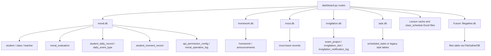

# Dashboard Refactor Plan

## 1. 当前模块职责审计

`lesson/models/datas_api/dashboard.py` 当前是一个 1412 行的聚合型 FastAPI 路由模块，混合了权限判断、路由函数、业务汇总、文件课表解析、多个 SQLite 数据库直连、返回结构组装和异常兜底。它承担 7 个驾驶舱入口：

| 路由 | 当前职责 | 主要权限 |
|------|----------|----------|
| `GET /api/dashboard/overview` | 当前用户可见驾驶舱总览、模块入口、低分预警 | 已登录用户，按角色裁剪 |
| `GET /api/dashboard/moral/summary` | 德育驾驶舱：学生、日常记录、德育分分布、班级排行 | admin / jiaowu / xuefa / cleader |
| `GET /api/dashboard/teaching/summary` | 教务驾驶舱：班级、学生、教师、课时排行、当前课程 | admin / jiaowu |
| `GET /api/dashboard/class/summary` | 班级驾驶舱：班级人数、性别、德育、作业、公告、请假、生日 | admin / jiaowu / xuefa / cleader |
| `GET /api/dashboard/teacher/workbench` | 教师工作台：今日课程、发布统计、德育参与、监考任务 | 当前教师 |
| `GET /api/dashboard/invigilation/summary` | 监考驾驶舱：项目状态、场次安排、通知状态、教师负载、异常列表 | admin / jiaowu |
| `GET /api/dashboard/system/summary` | 系统运维驾驶舱：数据库状态、用户身份、权限风险、操作审计、任务状态 | admin |

当前主要问题：

| 问题 | 说明 | 风险 |
|------|------|------|
| 巨型聚合文件 | 路由、服务、仓储、schema、文件解析全部在一个模块 | 后续加功能容易继续膨胀 |
| SQLite 直连散落 | `dashboard.py` 内仍有多处 `sqlite3.connect` | 连接策略、异常关闭和 row_factory 难统一 |
| 返回结构隐式 | 前端直接依赖 `cards/charts/tables/...` 字段，但后端没有契约测试 | 重构时容易破坏页面 |
| 异常处理不一致 | 多处 `try/except: pass`，失败后返回空数据 | 排障困难，但行为已被前端隐式接受 |
| 文件课表逻辑混入服务 | `Lesson`、pandas、课表文件扫描直接在路由模块内 | 教务逻辑难单测 |
| 系统统计重复连接 | system summary 对 `moral.db` 重复打开多次 | 可读性差，连接生命周期难审计 |
| 新需求缺少扩展点 | 文件上传系统数据展示尚未接入 | 若直接加到 `dashboard.py` 会继续变大 |

## 2. 函数级清单

| 函数名 | 当前职责 | 依赖数据库/资源 | sqlite3.connect 调用情况 | 返回结构 | 未来归属层 | 风险等级 | 建议 batch |
|--------|----------|----------------|--------------------------|----------|------------|----------|------------|
| `_now_text` | 格式化更新时间 | 无 | 无 | `str` | `schemas/common.py` 或 `utils.py` | 低 | Batch19 |
| `_is_jiaowu` | 教务权限判断 | `User` role | 无 | `bool` | `services/permissions.py` | 低 | Batch19 |
| `_is_moral_manager` | 德育管理权限判断 | `User` role | 无 | `bool` | `services/permissions.py` | 低 | Batch19 |
| `_date_range` | 生成日期列表 | 无 | 无 | `List[date]` | `services/date_utils.py` | 低 | Batch19 |
| `_metric` | 统一指标卡结构 | 无 | 无 | `{label,value,unit,route}` | `schemas/common.py` | 低 | Batch19 |
| `_normalize_top_n` | 限制 TopN 范围 | 无 | 无 | `int` | `schemas/common.py` | 低 | Batch19 |
| `_current_week_range` | 本周起止日期 | 无 | 无 | `{start,end}` | `services/date_utils.py` | 低 | Batch19 |
| `_safe_count` | 安全执行 count 查询 | moral repository-like db | 无 | `int` | `repositories/base.py` | 中 | Batch19 |
| `_safe_query_all` | 安全执行列表查询 | moral repository-like db | 无 | `List[dict]` | `repositories/base.py` | 中 | Batch19 |
| `_score_distribution` | 德育分段统计 | `moral.db` | 无 | `[{name,value}]` | `services/moral.py` | 中 | Batch21 |
| `_daily_event_mix` | 日常记录正负向统计 | `moral.db` | 无 | `[{name,value}]` | `services/moral.py` | 中 | Batch21 |
| `_daily_record_trend` | 近 14 天日常记录趋势 | `moral.db` | 无 | `[{date,count}]` | `services/moral.py` | 中 | Batch21 |
| `_class_score_rank` | 班级平均分排行 | `moral.db` | 无 | `[{class_name,avg_score,student_count}]` | `services/moral.py` | 中 | Batch21 |
| `_base_overview_cards` | 总览卡片和日常记录卡片 | `moral.db` | 无 | `List[metric]` | `services/overview.py` | 中 | Batch20 |
| `get_dashboard_overview` | 总览路由 | `moral.db` | 无 | `{success,data:{cards,modules,alerts,updated_at}}` | `routes.py` + `services/overview.py` | 中 | Batch20 |
| `get_moral_dashboard_summary` | 德育驾驶舱路由和数据聚合 | `moral.db` | 无 | `{success,data:{cards,charts,tables,top_n,updated_at}}` | `routes.py` + `services/moral.py` | 高 | Batch21 |
| `_schedule_frames_for_range` | 从缓存读取当前/下周课表 | `Lesson` cache | 无 | `[{df,monday,week_next}]` | 可废弃或 `services/schedule_files.py` | 中 | Batch20 |
| `_teacher_lesson_counts` | 教师课时统计代理 | 课表文件 | 无 | 同 `_teacher_lesson_counts_from_files` | `services/teaching.py` | 中 | Batch20 |
| `_month_keys_for_range` | 日期区间转月份 key | 无 | 无 | `List[str]` | `services/date_utils.py` | 低 | Batch19 |
| `_week_start_from_schedule_filename` | 从课表文件名解析周一日期 | 文件名 | 无 | `date/None` | `services/schedule_files.py` | 低 | Batch20 |
| `_schedule_files_for_range` | 扫描课表文件 | `lesson.lesson_dir` 文件系统 | 无 | `[{path,monday,file_name}]` | `repositories/schedule_files.py` | 中 | Batch20 |
| `_format_week_schedule_file` | 读取并格式化周课表 | Excel / pandas / Lesson | 无 | `DataFrame` | `services/schedule_files.py` | 中 | Batch20 |
| `_teacher_lesson_counts_from_files` | 按课表文件统计教师课时和教师个人课程 | Excel / pandas / Lesson | 无 | `{rows,covered_dates,source_files,lessons,message}` | `services/teaching.py` | 高 | Batch20 |
| `_minutes_from_time` | 时间字符串转分钟 | 无 | 无 | `int/None` | `services/date_utils.py` | 低 | Batch19 |
| `_find_current_period` | 当前作息节次识别 | `Lesson` time_table cache | 无 | `{period,label,time_range,all_periods}` | `services/teaching.py` | 中 | Batch20 |
| `_teacher_subject_lookup` | 科目到教师/课程映射 | `Lesson` teacher_template cache | 无 | `{subject:{teacher,course}}` | `services/teaching.py` | 中 | Batch20 |
| `_current_course_snapshot` | 当前课程快照 | `Lesson` today_schedule/class_template | 无 | `{current_period,current_classes,...}` | `services/teaching.py` | 高 | Batch20 |
| `get_teaching_dashboard_summary` | 教务驾驶舱路由和聚合 | `moral.db` + 课表文件/cache | 无 | `{success,data:{cards,charts,tables,current_course,range,covered_dates,source_files,top_n,message,updated_at}}` | `routes.py` + `services/teaching.py` | 高 | Batch20 |
| `_get_homework_db` | 打开 homework.db | `homework.db` | 1 处 | `sqlite3.Connection` with Row | `repositories/homework.py` | 中 | Batch22 |
| `_get_inout_db` | 打开 inout.db | `inout.db` | 1 处 | `sqlite3.Connection` with Row | `repositories/attendance.py` | 中 | Batch22 |
| `get_class_dashboard_summary` | 班级驾驶舱路由和聚合 | `moral.db` + `homework.db` + `inout.db` | 经 `_get_homework_db/_get_inout_db` | `{success,data:{cards,charts,tables,class_info,top_n,updated_at}}` | `routes.py` + `services/classroom.py` | 高 | Batch22 |
| `get_teacher_workbench` | 教师个人工作台路由和聚合 | 课表文件/cache + `homework.db` + `moral.db` + `invigilation.db` | 1 处直接 `sqlite3.connect(invigilation.db)` | `{success,data:{cards,tables,workload,range,updated_at}}` | `routes.py` + `services/teacher_workbench.py` | 高 | Batch24 |
| `_get_invigilation_db` | 打开 invigilation.db | `invigilation.db` | 1 处 | `sqlite3.Connection` with Row | `repositories/invigilation.py` | 中 | Batch23 |
| `get_invigilation_dashboard_summary` | 监考驾驶舱路由和聚合 | `invigilation.db` | 经 `_get_invigilation_db` | `{success,data:{cards,charts,tables,top_n,updated_at}}` | `routes.py` + `services/invigilation.py` | 高 | Batch23 |
| `_get_db_stats` | 数据库文件和表记录统计 | 任意 sqlite db 文件 | 1 处 | `{exists,size_kb,tables}` | `repositories/system.py` | 中 | Batch24 |
| `get_system_dashboard_summary` | 系统运维驾驶舱路由和聚合 | `moral.db` + `task.db` + 多数据库文件 | 5 处直接 `sqlite3.connect` + `_get_db_stats` | `{success,data:{cards,charts,tables,task_stats,updated_at}}` | `routes.py` + `services/system.py` | 高 | Batch24 |

## 3. 数据库依赖图



当前 `sqlite3.connect` 剩余调用点：

| 位置 | 数据库 | 当前用途 | 建议处理批次 |
|------|--------|----------|--------------|
| `_get_homework_db` | `homework.db` | 作业/公告统计 | Batch22 |
| `_get_inout_db` | `inout.db` | 请假统计 | Batch22 |
| `get_teacher_workbench` | `invigilation.db` | 当前教师近期监考任务 | Batch24 |
| `_get_invigilation_db` | `invigilation.db` | 监考驾驶舱统计 | Batch23 |
| `_get_db_stats` | 任意 sqlite db | 系统数据库文件统计 | Batch24 |
| `get_system_dashboard_summary` user_count | `moral.db` | 用户数和角色分布 | Batch24 |
| `get_system_dashboard_summary` teacher_stats | `moral.db` | 教师身份统计 | Batch24 |
| `get_system_dashboard_summary` api_permission_risks | `moral.db` | API 权限风险 | Batch24 |
| `get_system_dashboard_summary` operation logs | `moral.db` | 操作日志统计 | Batch24 |
| `get_system_dashboard_summary` task_stats | `task.db` | 定时任务状态 | Batch24 |

## 4. API 返回结构契约

后续重构必须保持以下外层契约：

```json
{
  "success": true,
  "data": {}
}
```

各 endpoint 的 `data` 字段契约：

| Endpoint | 必须保留的 data 字段 | 前端依赖 |
|----------|----------------------|----------|
| `/overview` | `cards`, `modules`, `alerts`, `updated_at` | `Overview.vue` |
| `/moral/summary` | `cards`, `charts.score_distribution`, `charts.daily_event_mix`, `charts.daily_record_trend`, `charts.class_score_rank`, `tables.low_students`, `top_n`, `updated_at` | `MoralDashboard.vue` |
| `/teaching/summary` | `cards`, `charts.teacher_workload_rank`, `charts.class_size_rank`, `charts.resource_mix`, `tables.teacher_workload`, `tables.teacher_workload_rank`, `current_course`, `range`, `covered_dates`, `source_files`, `top_n`, `message`, `updated_at` | `TeachingDashboard.vue` |
| `/class/summary` | `cards`, `charts.gender_mix`, `charts.score_band`, `tables.low_students`, `tables.birthday_this_month`, `tables.birthday_this_week`, `class_info`, `top_n`, `updated_at` | `ClassDashboard.vue` |
| `/teacher/workbench` | `cards`, `tables.today_lessons`, `tables.invigilation_tasks`, `tables.workload_lessons`, `workload`, `range`, `updated_at` | `TeacherWorkbench.vue` |
| `/invigilation/summary` | `cards`, `charts.project_status`, `charts.notification_status`, `charts.teacher_workload_rank`, `charts.teacher_workload_top5`, `tables.unarranged_slots`, `tables.conflict_slots`, `tables.notification_failed`, `tables.recent_projects`, `tables.teacher_workload_rank`, `tables.teacher_workload_top5`, `top_n`, `updated_at` | `InvigilationDashboard.vue` |
| `/system/summary` | `cards`, `charts.role_distribution`, `charts.operation_stats`, `charts.teacher_identity`, `tables.db_files`, `tables.api_permission_risks`, `tables.recent_operations`, `task_stats`, `updated_at` | `SystemDashboard.vue` |

通用 `cards` 元素契约：

```json
{
  "label": "指标名称",
  "value": 0,
  "unit": "单位",
  "route": "/optional-route"
}
```

禁止在重构中：

- 删除或改名上述字段。
- 把空列表改成 `null`。
- 把数值字段改成字符串。
- 删除兼容字段，例如 `teacher_workload_top5` 和 `teacher_workload_rank` 的双写。
- 改变权限失败的 HTTP 状态码和中文错误信息，除非单独有产品确认。

## 5. 拆分目标目录

建议最终从单文件迁移到包目录：

```text
lesson/models/datas_api/dashboard/
├── __init__.py
├── routes.py
├── schemas.py
├── services/
│   ├── __init__.py
│   ├── overview.py
│   ├── moral.py
│   ├── teaching.py
│   ├── classroom.py
│   ├── teacher_workbench.py
│   ├── invigilation.py
│   ├── system.py
│   └── filegather.py
├── repositories/
│   ├── __init__.py
│   ├── base.py
│   ├── moral.py
│   ├── homework.py
│   ├── attendance.py
│   ├── invigilation.py
│   ├── tasks.py
│   ├── system.py
│   └── filegather.py
└── providers/
    ├── __init__.py
    └── filegather_dashboard_provider.py
```

迁移方式建议：

1. 先保留旧 `dashboard.py` 为兼容入口。
2. 新包初期放在 `lesson/models/datas_api/dashboard_pkg/` 或类似临时名称，避免 Python 同名文件和目录冲突。
3. 当旧文件功能全部迁走后，再把旧 `dashboard.py` 转成导入兼容层，最后择机改成 `dashboard/` 包。

## 6. 分批执行计划

### Batch18：建立 Dashboard Contract Tests

修改目标：

- 新增只读契约测试，锁定 7 个 endpoint 的返回字段。
- 不改 `dashboard.py` 业务逻辑。

涉及文件：

- `lesson/tests/test_dashboard_contract.py`
- `docs/backend-refactor-notes.md`（仅在主线摘要、红线或验收基线变化时更新）

不允许改变的行为：

- endpoint 路径、权限错误、`success/data` 包装不变。
- 空数据情况下仍返回当前兼容结构。

测试要求：

- monkeypatch `get_moral_db`、`Lesson` 和 sqlite 连接，避免真实数据库。
- 至少覆盖 `_metric`、`_normalize_top_n`、`_current_week_range`、路由返回字段形状。

验收命令：

```bash
python -m pytest lesson/tests/test_dashboard_contract.py -q
python -m pytest -q
```

回滚风险点：

- 测试 fake db 与真实 `MoralDatabase` 接口不一致时会产生伪绿，需要保持 fake 接口极小且贴近现有调用。

### Batch19：抽取 Dashboard 公共工具与连接辅助层

修改目标：

- 抽取 `_metric`、`_normalize_top_n`、日期工具、权限判断、安全查询。
- 建立 dashboard repository base，只做无行为变化迁移。

涉及文件：

- `lesson/models/datas_api/dashboard_shared.py` 或临时 `dashboard_pkg/common.py`
- `lesson/tests/test_dashboard_common.py`

不允许改变的行为：

- 不改 endpoint 返回结构。
- 不改 SQL。
- 不迁移业务函数。

测试要求：

- 单测公共工具。
- 全量 contract tests 通过。

验收命令：

```bash
python -m pytest lesson/tests/test_dashboard_common.py lesson/tests/test_dashboard_contract.py -q
python -m pytest -q
```

回滚风险点：

- 同名包迁移过早会引发 import 冲突，建议先用临时模块名。

### Batch20：拆 Overview / Teaching 数据

修改目标：

- 拆 `_base_overview_cards`、`get_dashboard_overview` 的服务层。
- 拆课表文件扫描、教师课时统计、当前课程快照。

涉及文件：

- `services/overview.py`
- `services/teaching.py`
- `repositories/schedule_files.py`
- `lesson/tests/test_dashboard_teaching_contract.py`

不允许改变的行为：

- `teacher_workload_rank`、`class_size_rank`、`resource_mix`、`current_course` 字段不变。
- 时间范围最大 62 天限制不变。
- Excel 课表解析失败时仍返回空统计，不抛 500。

测试要求：

- monkeypatch `Lesson` 和 pandas DataFrame。
- 覆盖无课表、有课表、指定教师、跨月课表目录。

验收命令：

```bash
python -m pytest lesson/tests/test_dashboard_contract.py lesson/tests/test_dashboard_teaching_contract.py -q
python -m pytest -q
```

回滚风险点：

- 课表文件统计依赖真实文件名规则，测试必须覆盖文件名日期解析。

### Batch21：拆 Moral 数据

修改目标：

- 拆德育分布、日常记录趋势、班级分数排行、低分学生。

涉及文件：

- `services/moral.py`
- `repositories/moral.py`
- `lesson/tests/test_dashboard_moral_contract.py`

不允许改变的行为：

- cleader 只能看本班的权限收敛不变。
- `top_n` 范围不变。
- `%s` 占位符传入 `get_moral_db` 的兼容行为不变。

测试要求：

- fake db 记录 SQL 和 params。
- 覆盖 admin、jiaowu、xuefa、cleader 无班级等权限路径。

验收命令：

```bash
python -m pytest lesson/tests/test_dashboard_moral_contract.py lesson/tests/test_dashboard_contract.py -q
python -m pytest -q
```

回滚风险点：

- where_clause 拼接容易改变 SQL 语义，需要先锁定参数和空数据返回。

### Batch22：拆 Class / Attendance / Homework 数据

修改目标：

- 拆班级驾驶舱服务。
- 将 `_get_homework_db`、`_get_inout_db` 迁入 repository 并使用 sqlite_base。

涉及文件：

- `services/classroom.py`
- `repositories/homework.py`
- `repositories/attendance.py`
- `lesson/tests/test_dashboard_class_contract.py`

不允许改变的行为：

- 班主任只能看本班。
- 作业/公告/请假数据库异常继续返回 0，不影响班级主数据。
- birthday 列表字段保持不变。

测试要求：

- fake moral db + monkeypatch homework/inout sqlite。
- 覆盖 homework.db 不存在或表不存在的兼容路径。

验收命令：

```bash
python -m pytest lesson/tests/test_dashboard_class_contract.py -q
python -m pytest -q
rg "sqlite3.connect|sqlite3.Connection" lesson/models/datas_api/dashboard.py -n
```

回滚风险点：

- 从直接 sqlite 迁到 repository 后，异常吞掉行为要保持，否则页面可能出现 500。

### Batch23：拆 Invigilation 数据

修改目标：

- 拆监考驾驶舱服务和 repository。
- 迁移 `_get_invigilation_db` 到 sqlite_base。

涉及文件：

- `services/invigilation.py`
- `repositories/invigilation.py`
- `lesson/tests/test_dashboard_invigilation_contract.py`

不允许改变的行为：

- 无监考库或查询异常时返回空统计。
- `teacher_workload_rank` 和 `teacher_workload_top5` 双字段保留。

测试要求：

- 使用临时 invigilation.db 创建最小表。
- 覆盖项目状态、未安排、冲突、通知失败、近期项目。

验收命令：

```bash
python -m pytest lesson/tests/test_dashboard_invigilation_contract.py -q
python -m pytest -q
```

回滚风险点：

- 冲突场次计算有业务语义，不能在抽取时“优化”公式。

### Batch24：拆 Teacher Workbench / System 数据

修改目标：

- 拆教师工作台服务。
- 拆系统运维服务。
- 将 `_get_db_stats` 和 system summary 的 moral/task 直连迁到 sqlite_base repository。

涉及文件：

- `services/teacher_workbench.py`
- `services/system.py`
- `repositories/system.py`
- `repositories/tasks.py`
- `lesson/tests/test_dashboard_system_contract.py`
- `lesson/tests/test_dashboard_teacher_workbench_contract.py`

不允许改变的行为：

- 系统驾驶舱仅 admin 可看。
- 任务表不存在时 `task_stats` 保持默认 0。
- 教师工作台日期范围最大 31 天限制不变。

测试要求：

- 临时 db 文件覆盖 `_get_db_stats`。
- monkeypatch `Lesson`、homework、invigilation、moral db。

验收命令：

```bash
python -m pytest lesson/tests/test_dashboard_system_contract.py lesson/tests/test_dashboard_teacher_workbench_contract.py -q
python -m pytest -q
```

回滚风险点：

- system summary 多处 `try/except: pass` 的兼容行为不要一次性改成强错误。

### Batch25：接入 FileGather Dashboard Provider

修改目标：

- 新增文件上传系统数据 provider。
- 在教务驾驶舱或系统驾驶舱中接入文件上传指标，优先接入教务驾驶舱。

涉及文件：

- `providers/filegather_dashboard_provider.py`
- `repositories/filegather.py`
- `services/filegather.py`
- `services/teaching.py`
- `lesson/tests/test_dashboard_filegather_provider.py`
- `frontend/src/views/dashboard/TeachingDashboard.vue` 仅在后端契约稳定后再改

不允许改变的行为：

- 现有教务驾驶舱字段不变，只新增 `filegather` 相关字段或 cards。
- filegather.db 不存在时返回 0 和空列表，不抛 500。

测试要求：

- 使用临时 filegather.db 或 monkeypatch `FileGatherDB`。
- 覆盖 pending/done/month/user/copies/recent 列表。

验收命令：

```bash
python -m pytest lesson/tests/test_dashboard_filegather_provider.py lesson/tests/test_dashboard_teaching_contract.py -q
python -m pytest -q
```

回滚风险点：

- 前端新增展示必须兼容后端缺字段状态，先后端后前端。

### Batch26：旧 dashboard.py 收口

修改目标：

- 将旧巨型 `dashboard.py` 转为兼容入口或删除残留。
- 完成 `dashboard/` 包化。

涉及文件：

- `lesson/models/datas_api/dashboard.py`
- `lesson/models/datas_api/dashboard/`
- FastAPI router 注册处
- 全部 dashboard contract tests

不允许改变的行为：

- API path、tag、summary、返回结构不变。
- import 路径兼容现有 `from models.datas_api.dashboard import router`。

测试要求：

- 全量 contract tests。
- 全量后端测试。
- 前端 build。

验收命令：

```bash
python -m pytest -q
cd frontend && npm run build
```

回滚风险点：

- Python 文件与同名目录冲突，包化顺序必须小心；必要时先使用 `dashboard_pkg`，最后一批再改名。

## 7. 文件上传系统数据展示设计

用户提出希望“在教务驾驶舱中增加文件上传系统相关的数据展示”。建议在 Batch25 执行，不在 Batch17 修改代码。

数据来源：

- 首选 `lesson/models/filegather_db.py` 的 `FileGatherDB`。
- 数据库是 `filegather.db`，当前模型已在 Batch13 迁移到 sqlite_base。

建议 provider 接口：

```python
class FileGatherDashboardProvider:
    def get_summary(self, limit: int = 10) -> dict:
        return {
            "cards": [],
            "charts": {},
            "tables": {},
        }
```

建议后端返回字段：

```json
{
  "filegather": {
    "cards": [
      {"label": "上传文件", "value": 0, "unit": "个", "route": "/filegather"},
      {"label": "待处理", "value": 0, "unit": "个", "route": "/filegather"},
      {"label": "已完成", "value": 0, "unit": "个", "route": "/filegather"}
    ],
    "charts": {
      "status_mix": [],
      "monthly_trend": [],
      "user_upload_rank": [],
      "copies_summary": []
    },
    "tables": {
      "recent_uploads": [],
      "recent_done": []
    }
  }
}
```

可展示指标：

| 指标 | 来源建议 | 展示位置 |
|------|----------|----------|
| 文件上传总数 | `files` 总数 | 教务 cards |
| 待处理文件数 | `status = '否'` 或当前未完成状态 | 教务 cards |
| 已完成文件数 | `status = '是'` | 教务 cards |
| 按用户/教师上传数量 | `GROUP BY uploader/user_name`，以实际字段为准 | 教务 chart |
| 按月份上传趋势 | `month` 或 `uploaded_at` | 教务 chart |
| 打印份数统计 | `SUM(copies)` | 教务 cards/chart |
| 最近上传文件列表 | `ORDER BY uploaded_at DESC LIMIT n` | 教务 table |
| 最近完成文件列表 | `done_at IS NOT NULL ORDER BY done_at DESC LIMIT n` | 教务 table |

实现原则：

- 不在 `dashboard.py` 里直接写 filegather SQL。
- provider 负责把缺库、缺表、字段差异转换成空数据。
- 前端先做可选字段渲染，后端缺 `filegather` 时页面不报错。
- filegather 统计作为独立 provider 接入 `services/teaching.py`，不要让 teaching service 直接知道 filegather 表结构。

## 8. 测试策略

分层测试：

| 层级 | 测试目标 |
|------|----------|
| Contract tests | 锁定 7 个 endpoint 的 `success/data` 字段结构 |
| Repository tests | 使用临时 SQLite 文件验证 SQL、row_factory、缺表兜底 |
| Service tests | monkeypatch repositories，验证聚合和空数据行为 |
| Provider tests | filegather provider 的缺库/有数据/字段缺失 |
| Full regression | `python -m pytest -q` |
| Frontend smoke | 最后包化或前端改动时运行 `npm run build` |

测试优先级：

1. 先写 contract tests。
2. 再迁移连接层。
3. 每拆一个服务，必须先有对应 contract tests。
4. 每新增一个 repository，必须有临时 DB 测试。

## 9. 回滚策略

| 场景 | 回滚方式 |
|------|----------|
| 新服务结果和旧路由不一致 | 旧 `dashboard.py` 保留原逻辑，只回滚服务接入点 |
| sqlite_base 迁移导致连接失败 | repository 层单独回滚，不动路由层 |
| 前端字段缺失 | contract tests 阻止合入；恢复旧字段或补兼容别名 |
| 包化 import 冲突 | 保留 `dashboard.py`，新包临时命名为 `dashboard_pkg` |
| filegather 缺库 | provider 返回空结构，不影响教务驾驶舱 |

每批次都应保持：

- 单批改动可独立回滚。
- 不跨批次删除旧函数。
- 文档同步到对应专题文档；`docs/backend-refactor-notes.md` 仅维护轻量主线索引。
- 不执行真实数据清理。

## 10. 禁止事项

- 禁止一次性重写 `dashboard.py`。
- 禁止修改现有 API path。
- 禁止改变 `success/data` 外层结构。
- 禁止把空列表改成 `null`。
- 禁止把错误吞掉行为改成 500，除非对应契约测试和产品确认同步修改。
- 禁止在 dashboard 服务中直接新增 filegather SQL。
- 禁止在 Batch18-B24 修改前端展示。
- 禁止执行 `python lesson/scripts/cleanup_raw_pwd.py --apply --yes`。
- 禁止修改 `.claude/settings.local.json` 和 `scripts/unix/start-backend.sh`。
